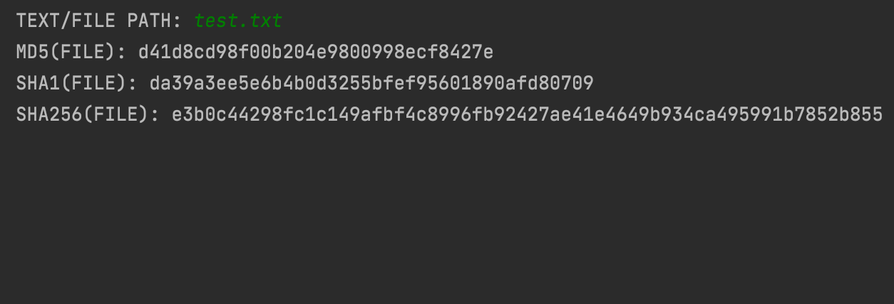

# HASHTOOL
Simple tool that creates hash from given input. You can input file by entering the file path, or just enter text. Then you will se the output in MD5, SHA1 and SHA256. 
 

# Usage
1. Run the script
2. Input text or file path and click enter
3. Result will be displayed when program finishes hashing

# Author
Filip Rokita 
www.filiprokita.com
